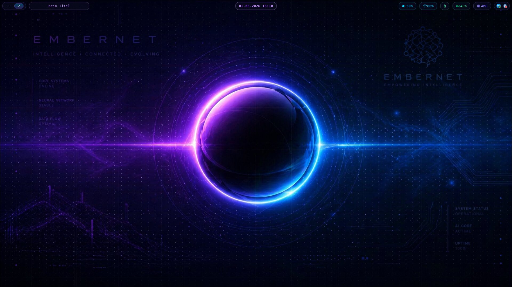

# eurobertics/dotfiles-desktop



Hyprland Desktop Setup auf CachyOS. Terminal-zentrierter Workflow mit EmberNet Theme.

> Für das Neovim/DevContainer/Server Setup → [eurobertics/dotfiles](https://github.com/eurobertics/dotfiles)

---

## Stack

| Komponente | Programm |
|---|---|
| Distro | CachyOS (Arch-basiert, BORE-Kernel) |
| Window Manager | Hyprland (Wayland) |
| Terminal | kitty |
| Shell | Fish |
| Editor | Neovim |
| Status Bar | Waybar |
| Launcher | Wofi |
| Notifications | Mako |
| Dateimanager | Yazi |
| Mail | Neomutt + mbsync + msmtp |
| Kalender | khal + vdirsyncer |
| Kontakte | khard |
| Aufgaben | todoman |
| Theme | EmberNet (selbst designed) |

---

## Installation

```bash
git clone https://github.com/eurobertics/dotfiles-desktop ~/.dotfiles-desktop
cd ~/.dotfiles-desktop
chmod +x install.sh
./install.sh
```

Pakete vorher installieren – siehe [packages.md](packages.md).

Das Script legt alle Symlinks an und erstellt benötigte Verzeichnisse (inkl. `~/.local/share/mail/`).

---

## Konfiguration nach Installation

### 1. Passwörter in gnome-keyring eintragen

```bash
# IMAP Konten
secret-tool store --label="IMAP Account 1" service imap-account1 username YOUR_EMAIL_1@DOMAIN1
secret-tool store --label="IMAP Account 2" service imap-account2 username YOUR_EMAIL_2@DOMAIN2

# SMTP Konten
secret-tool store --label="SMTP Account 1" service smtp-account1 username YOUR_EMAIL_1@DOMAIN1
secret-tool store --label="SMTP Account 2" service smtp-account2 username YOUR_EMAIL_2@DOMAIN2
```

### 2. mbsync konfigurieren

Platzhalter in `~/.mbsyncrc` ersetzen (Symlink auf `mbsync/mbsyncrc` im Repo):

- `YOUR_IMAP_HOST_1` / `YOUR_IMAP_HOST_2` – IMAP-Hostname des Mailservers
- `YOUR_EMAIL_1@DOMAIN1` / `YOUR_EMAIL_2@DOMAIN2` – E-Mail-Adressen
- `account1` / `account2` – sprechende Namen für die Postfächer

Die Mailverzeichnisse werden automatisch vom `install.sh` angelegt:
```
~/.local/share/mail/account1/
~/.local/share/mail/account2/
```

### 3. Mail-Configs anpassen

Platzhalter in diesen Dateien ersetzen:

- `~/.config/neomutt/neomuttrc` – `YOUR_EMAIL_1`, `YOUR_EMAIL_2`, `YOUR_SMTP_HOST_*`
- `~/.config/msmtp/config` – gleiche Platzhalter
- `~/.config/goimapnotify/account1.json` und `account2.json` aus `.example` Dateien erstellen

```bash
cp ~/.dotfiles-desktop/goimapnotify/account1.json.example ~/.config/goimapnotify/account1.json
cp ~/.dotfiles-desktop/goimapnotify/account2.json.example ~/.config/goimapnotify/account2.json
# Dann beide Dateien mit Editor anpassen
```

### 4. vdirsyncer anpassen

```bash
# ~/.config/vdirsyncer/config
# YOUR_NEXTCLOUD_URL, YOUR_USERNAME, YOUR_APP_PASSWORD ersetzen
# App-Password in Nextcloud unter Einstellungen → Sicherheit erstellen
```

### 5. mbsync initialisieren

```bash
mbsync -a
```

### 6. Systemd Timer aktivieren

```bash
systemctl --user enable --now mbsync.timer
systemctl --user enable --now vdirsyncer.timer
```

### 7. vdirsyncer initialisieren

```bash
vdirsyncer discover
vdirsyncer sync
```

### 8. pcscd starten
```bash
sudo systemctl --user enable --now pcscd.service
```

---

## EmberNet Theme Farben

| Farbe | Hex | Verwendung |
|---|---|---|
| Hintergrund | `#0a0a1e` | Fenster, Module |
| Violett | `#6C5CE7` | Akzent, Border |
| Lila/Rosa | `#c084fc` | Uhr, Tidal, Glow |
| Cyan | `#00D4FF` | Audio, Netzwerk |
| Grün | `#34d399` | Akku, OK-Status |
| Rot | `#f87171` | Kritisch, Fehler |
| Text | `#e2e8f0` | Standard Text |

---

## Cheat Sheets

Alle Cheat Sheets liegen unter `docs/`:

- [Hyprland](docs/hyprland-cheatsheet.md)
- [Neomutt](docs/neomutt-cheatsheet.md)
- [Yazi](docs/yazi-cheatsheet.md)
- [Neovim](docs/neovim-cheatsheet.md)

---

## Hinweise

- Wallpaper liegt **nicht** im Repo (zu groß). `hyprpaper.conf` anpassen.
- `tuxedo-drivers-dkms` ist Tuxedo-Hardware spezifisch – auf anderen Geräten überspringen.
- goimapnotify JSON-Dateien im Repo sind `.example` Dateien ohne echte Zugangsdaten.
- `.mbsyncrc` liegt im Home-Verzeichnis (nicht in `~/.config/`) – so erwartet es mbsync.

---

*Terminal-Tiling-Monster | CachyOS / Hyprland | EmberNet Theme*
